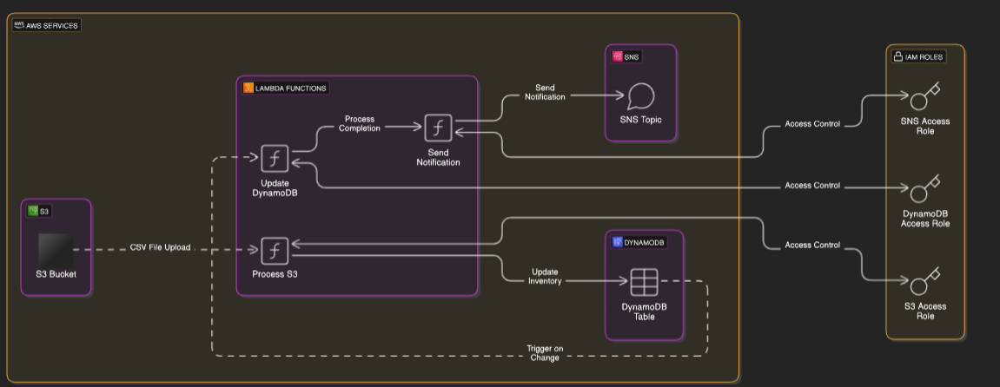

# Deploying a Serverless Workflow on AWS

# AWS Resources used

- S3
- Lambda
- DynamoDB
- SNS

# Deployment Steps

## Create AWS Resources

1. S3 Bucket

- Navigate to S3 in AWS Console → Create a new S3 Bucket.
- Note the ARN for later use.

2. DynamoDB Table

- Navigate to DynamoDB → Create a table with Partition Key & Sort Key.
- Note the ARN.

3. SNS Topic

- Navigate to SNS → Create a Standard SNS Topic.
- Create a Subscription (Protocol: Email, add your email, and confirm via email).

4. Create IAM Roles

- Lambda Role for S3 & DynamoDB
- Create an IAM Policy with S3 (Get/List) and DynamoDB (Put/BatchWrite) permissions.
- Attach policy to a new IAM Role for Lambda.
- Lambda Role for DynamoDB & SNS
- Create another IAM Policy with DynamoDB (Get/Put/Query/Scan) and SNS (Publish) permissions.
- Attach policy to a new IAM Role.

## Deploy Lambda Functions

1. Lambda: S3 to DynamoDB

- Create a Lambda function (Runtime: Python).
- Upload the provided Python script to process CSV files from S3 → DynamoDB.
- Set S3 as a trigger (Event type: Object created, Suffix: .csv).
- Assign the S3-DynamoDB Role.

2. Lambda: DynamoDB to SNS

- Create another Lambda function to scan DynamoDB and send SNS notifications.
- Set DynamoDB as a trigger.
- Assign the DynamoDB-SNS Role.

## Testing

- Upload a CSV file (Store, Product, Count) to S3.
- Lambda processes file & updates DynamoDB.
- If inventory < 5, an email alert is sent via SNS.

## Cleanup (Optional)

- Delete S3 Bucket, SNS Topic, DynamoDB Table, Lambda Functions, IAM Roles/Policies.

## Infrastructure as Code (Optional)

### Use CloudFormation to automate deployment:

- Navigate to CloudFormation → Create Stack → Upload YAML template.
- Provide Stack Name, Email, and S3 Bucket Name.
- Confirm SNS Subscription via email.
  Follow the Testing steps.
